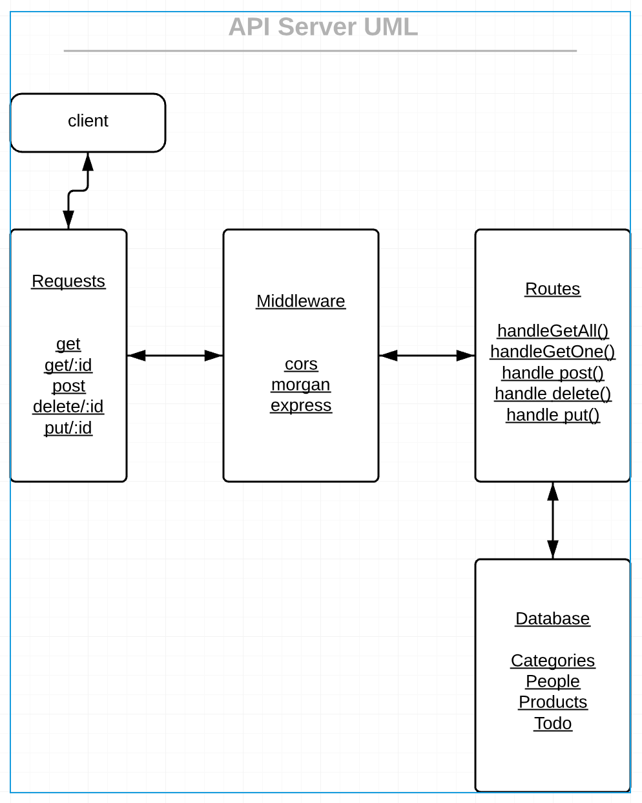

# LAB - 09

## JSDocs

### Author: Brandyn Vay

### Links and Resources
* [submission PR](https://github.com/brandyn-vay-401-advanced-javascript/lab-class-09)
* [travis](https://travis-ci.com/brandyn-vay-401-advanced-javascript/lab-class-09)

#### Documentation
* [jsdoc](https://bv-api-server.herokuapp.com/docs/)

### Modules
#### `v1.js`
#### `swagger.js`
#### `categories-model.js`
#### `categories-schema.js`
#### `people-model.js`
#### `products-model.js`
#### `products-schema.js`
#### `todo-model.js`
#### `todo-schema.js`
#### `memory.js`
#### `mongo.js`s
#### `app.js`

### Setup
#### `.env` requirements
* `PORT` - 3000
* `MONGODB_URI` - mongodb://localhost:27017/`database Name`
  
#### Tests
* How do you run tests? Run npm test in terminal.

#### UML

